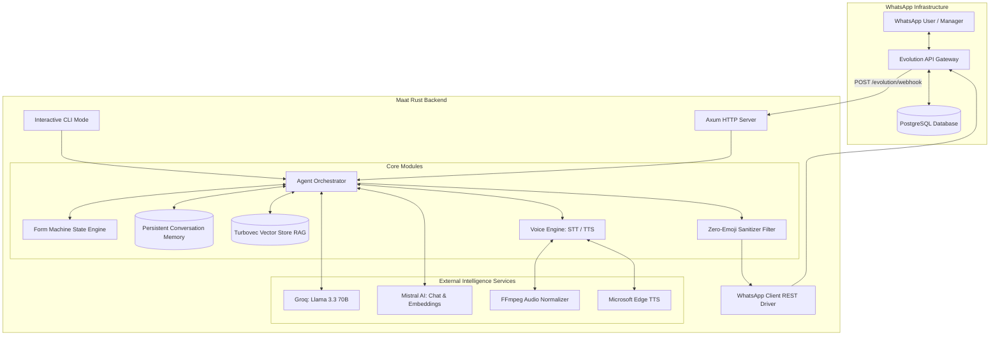

# Maat: WhatsApp AI Workforce and Executive Operations Engine

Maat is a high-performance, asynchronous WhatsApp personal assistant and workforce management engine written in Rust. Designed for site operations, field worker coordination, and executive decision support, Maat bridges the gap between field communications and centralized enterprise oversight through WhatsApp.

The system features dual-role conversational intelligence, real-time speech processing, retrieval-augmented generation (RAG) powered by vector search, persistent conversational memory, deterministic form state machines, and strict executive communication standards.

---

## Key Highlights

- High-Performance Rust Architecture: Built on Tokio asynchronous runtime and Axum 0.7 web framework for low-latency, concurrent message handling.
- Dual-Persona Orchestration:
  - Executive / Manager Mode (Sudo Access): Privileged interface for management inquiries, automated operational audits, worker status reports, and deterministic zero-emoji output formatting.
  - Team / Field Worker Mode: Context-aware conversational interface with dialectal Arabic support, automated profile learning, and assisted onboarding.
- Interactive Form State Machine: Guided multi-step registration workflow collecting full name, job specialization, national ID, daily wage rate, site location, and equipment notes.
- Embedded Vector Database and RAG: Powered by Turbovec and Mistral embeddings (`mistral-embed`), indexing worker profiles, site reports, and operational logs with cosine similarity retrieval.
- Persistent Multi-Turn Memory: File-backed state persistence tracking conversation history, dynamic name recognition, and structured worker profiles across server restarts.
- End-to-End Voice Processing:
  - Speech-to-Text (STT): Converts inbound WhatsApp voice notes via FFmpeg and Mistral Voxtral/Whisper.
  - Text-to-Speech (TTS): Generates Egyptian Arabic voice notes using neural Edge TTS (`ar-EG-SalmaNeural`) packaged into WhatsApp-native OGG Opus.
- Sub-Second LLM Inference: Primary chat intelligence backed by Groq (Llama-3.3-70B-Versatile) with fallback to Mistral AI (`mistral-small-latest`).
- WhatsApp Gateway Integration: Production integration with Evolution API and PostgreSQL, supporting automated webhook registration, session recovery, and retry mechanisms.
- Interactive CLI Simulation: Built-in local testing environment allowing end-to-end verification without live webhook dependencies.
- Zero-Emoji Sanitization: Kernel-level Unicode sanitization pipeline guaranteeing clean, strictly professional executive communication.

---

## Architecture Overview



---

## Core Systems and Capabilities

### 1. Dual-Persona Intelligence

Maat implements role-based prompt engineering and routing based on incoming phone numbers:

| Persona | Target Audience | Behavioral Constraints | Primary Functions |
|---|---|---|---|
| Executive / Manager Mode | Project Directors, Site Managers | Strict formal tone, zero emojis, structured executive summaries, high analytical density | Field status queries, payroll/rate calculations, worker verification, site allocation inspection |
| Field Worker Mode | Laborers, Technicians, Contractors | Respectful Arabic / Egyptian dialect, accessible phrasing, supportive guidance | Step-by-step registration, daily task reporting, administrative contact delivery |

### 2. Zero-Emoji Enforcement Engine

For executive communication channels, Maat enforces a zero-emoji policy. Responses directed to registered managers pass through a specialized regex sanitization filter that strips:

- Standard Unicode emoticons (`\u{1F600}` to `\u{1F64F}`)
- Miscellaneous symbols and pictographs (`\u{1F300}` to `\u{1F5FF}`)
- Transport and map symbols (`\u{1F680}` to `\u{1F6FF}`)
- Extended symbols and pictographs (`\u{1FA00}` to `\u{1FAFF}`)
- Dingbats, flags, and geometric glyphs (`\u{2600}` to `\u{27BF}`)
- Punctuation spacing anomalies resulting from stripped characters

### 3. Interactive Onboarding State Machine

The `FormMachine` coordinates structured user data collection without external form builders. When triggered by relevant keywords (such as "register" or "submit data"), the agent transitions users through the following states:

1. `AskFullName`: Collects full legal name.
2. `AskJobRole`: Collects trade or profession (e.g., carpenter, welder, engineer).
3. `AskNationalId`: Records national identification number.
4. `AskDailyRate`: Captures daily wage rate in EGP.
5. `AskWorkLocation`: Identifies designated project site.
6. `AskNotes`: Gathers handover notes or equipment status.
7. `Completed`: Commits data to persistent memory and vector indexes the profile for semantic search.

### 4. Turbovec Vector RAG and Semantic Memory

Maat incorporates vector retrieval to enable cross-chat awareness and context injection:

- Vector Quantization: Powered by `turbovec::TurboQuantIndex` for vector similarity clustering.
- Embeddings Pipeline: Embeddings generated via Mistral Embed (`mistral-embed`), backed by a deterministic dimensional hashing fallback.
- Auto-Ingestion: Incoming field messages longer than standard greetings are ingested as daily logs and tagged with timestamps and author identities.
- Hybrid Retrieval: Supports cosine similarity searches, direct identifier filtering, and phone number indexing.

### 5. Bi-Directional Voice Pipeline

Maat natively processes WhatsApp audio notes:

- Audio Normalization: Inbound audio files are downloaded, sanitized, and resampled via FFmpeg (16 kHz, mono MP3).
- Speech Recognition: Transcribed via Mistral Audio (`voxtral-mini-latest`) or OpenAI Whisper API compatibility layer.
- Speech Synthesis: Outbound responses are synthesized using Microsoft Edge TTS with the `ar-EG-SalmaNeural` model.
- Container Packaging: Synthesized MP3 streams are converted into WhatsApp-compliant OGG Opus (`libopus`, 32 kbps VBR) for voice note rendering.

---

## Technology Stack

| Layer | Component / Tool | Version / Model | Description |
|---|---|---|---|
| Language | Rust | 2021 Edition (1.75+) | High-safety, memory-efficient core system |
| Concurrency | Tokio | 1.38 | Multi-threaded asynchronous runtime |
| Web Framework | Axum | 0.7 | High-performance asynchronous HTTP router |
| Primary LLM | Groq Cloud | Llama-3.3-70b-versatile | Ultra-fast chat completions (sub-500ms latency) |
| Secondary LLM | Mistral AI | mistral-small-latest | Secondary chat completion fallback |
| Vector Embeddings | Mistral AI | mistral-embed | 1024-dimensional semantic embeddings |
| Vector Index | Turbovec | 1.0.0 | Quantized in-memory vector search engine |
| WhatsApp Gateway | Evolution API | latest (Docker) | Multi-device WhatsApp protocol adapter |
| Database | PostgreSQL | 15-alpine (Docker) | Session and message store for Evolution API |
| Speech-to-Text | Mistral Voxtral | voxtral-mini-latest | Audio note transcription |
| Text-to-Speech | Edge TTS | ar-EG-SalmaNeural | Natural Egyptian Arabic voice generation |
| Audio Codecs | FFmpeg | System package | MP3 conversion and OGG Opus stream encoding |

---

## Project Structure

```
maat/
├── Cargo.toml                  # Rust dependencies and package configuration
├── Cargo.lock                  # Locked dependency graph
├── .env.example                # Configuration template
├── start.sh                    # Orchestrated startup script for containers and engine
├── evolution_api/
│   └── docker-compose.yml      # Docker configuration for Evolution API and PostgreSQL
└── src/
    ├── main.rs                 # Server entry point, CLI routing, Axum handlers
    ├── config.rs               # Environment variables and configuration loader
    ├── models.rs               # Data structures, payloads, and domain models
    ├── voice.rs                # Speech-to-Text and Text-to-Speech integration
    ├── whatsapp.rs             # Evolution API HTTP client with retry logic
    ├── agent/
    │   ├── mod.rs              # Agent module declarations
    │   ├── orchestrator.rs     # Central routing, LLM dispatch, voice workflow
    │   ├── form_machine.rs     # Multi-step worker onboarding state machine
    │   ├── memory.rs           # Multi-turn conversational memory and disk persistence
    │   ├── prompt.rs           # Persona system prompts (Executive vs Worker)
    │   └── emoji.rs            # Unicode regex-based emoji stripping pipeline
    └── rag/
        ├── mod.rs              # RAG module declarations
        └── vector_store.rs     # Turbovec integration, embeddings, and similarity search
```

---

## Prerequisites

Before running Maat, ensure the following tools are installed on your host system:

- Rust Toolchain: `rustc` and `cargo` (version 1.75 or higher).
- Docker and Docker Compose: For hosting Evolution API and PostgreSQL.
- FFmpeg: Required for audio conversion (`sudo apt install ffmpeg` on Ubuntu/Debian).
- Python 3 and Edge-TTS: Required for voice note synthesis (`pip install edge-tts`).
- Git: For source code management.

---

## Configuration

Copy `.env.example` to `.env` and provide your credentials:

```bash
cp .env.example .env
```

### Environment Variables

| Variable | Required | Default Value | Description |
|---|---|---|---|
| `EVOLUTION_API_URL` | Yes | `http://localhost:8085` | URL of the Evolution API service |
| `EVOLUTION_API_KEY` | Yes | `maat_evolution_secret_key_2026` | API authentication key for Evolution API |
| `EVOLUTION_INSTANCE_NAME` | Yes | `maat` | Name of the WhatsApp connection instance |
| `GROQ_API_KEY` | Recommended | - | API key for ultra-fast Llama-3.3 inference |
| `MISTRAL_API_KEY` | Recommended | - | API key for embeddings, STT, and LLM fallback |
| `TAVILY_API_KEY` | Optional | - | Search API key for web-grounded research |
| `MANAGER_PHONE` | Yes | `201224455366` | Normalized phone number granted Sudo Mode access |
| `PORT` | No | `8080` | Port for the Axum webhook server |

---

## Installation and Deployment

### Step 1: Clone the Repository

```bash
git clone https://github.com/EbrahimEldesoky/maat-.git
cd maat-
```

### Step 2: Configure Environment

```bash
cp .env.example .env
# Edit .env with your favorite editor and populate API keys
nano .env
```

### Step 3: Launch Supporting Infrastructure

Start PostgreSQL and Evolution API using Docker Compose:

```bash
cd evolution_api
docker compose up -d
cd ..
```

Wait approximately 10 to 15 seconds for the Evolution API service to become healthy on port `8085`.

### Step 4: Configure Instance and Pair WhatsApp

Configure the instance webhook and persistent connection settings:

```bash
# Register Webhook
curl -X POST http://localhost:8085/webhook/set/maat \
  -H "apikey: maat_evolution_secret_key_2026" \
  -H "Content-Type: application/json" \
  -d '{
    "webhook": {
      "enabled": true,
      "url": "http://host.docker.internal:8080/evolution/webhook",
      "byEvents": false,
      "base64": false,
      "events": ["MESSAGES_UPSERT"]
    }
  }'

# Enable Always Online Mode
curl -X POST http://localhost:8085/settings/set/maat \
  -H "apikey: maat_evolution_secret_key_2026" \
  -H "Content-Type: application/json" \
  -d '{
    "rejectCall": false,
    "groupsIgnore": false,
    "alwaysOnline": true,
    "readMessages": false,
    "readStatus": false,
    "syncFullHistory": false
  }'
```

Access the Evolution API dashboard or retrieve the instance QR code from:

```
http://localhost:8085/instance/connect/maat
```

Scan the QR code with WhatsApp on your target device (Linked Devices > Link a Device).

### Step 5: Start the Maat Backend

You can launch the system using Cargo directly:

```bash
cargo run --release
```

Alternatively, use the automated startup script which handles container initialization, webhook registration, and binary execution:

```bash
chmod +x start.sh
./start.sh
```

---

## Interactive CLI Test Mode

Maat includes a built-in interactive terminal mode for local development, system testing, and query debugging without triggering WhatsApp webhooks.

Run the binary with the `--cli` or `-c` flag:

```bash
cargo run -- --cli
```

### Supported CLI Commands

| Command | Syntax | Description |
|---|---|---|
| Manager Query | `/manager <text>` | Simulates an inquiry from `MANAGER_PHONE` with Zero-Emoji Sudo Mode |
| Worker Simulation | `/worker <phone> <text>` | Simulates a message or form submission from a specific worker phone number |
| Vector RAG Search | `/rag <query>` | Performs a semantic similarity search directly against `VectorStore` |
| Profile Inspection | `/profile <phone>` | Displays stored profile attributes, metadata, and conversation history |
| Exit | `/exit` | Terminates the interactive CLI harness |

---

## API Reference

### Health Check

Returns the operational status of the Maat backend service.

- Endpoint: `GET /health`
- Response: `200 OK`
- Format:
  ```json
  {
    "service": "maat",
    "status": "healthy",
    "version": "2.0.0"
  }
  ```

### Evolution API Webhook Receiver

Ingests incoming WhatsApp event payloads emitted by Evolution API.

- Endpoint: `POST /evolution/webhook`
- Payload: Evolution API `MESSAGES_UPSERT` JSON structure
- Behavior:
  - Validates event type and sender authenticity.
  - Filters out outbound bot messages (`fromMe: true`) and group chats (`@g.us`).
  - Normalizes sender phone numbers.
  - Dispatches message to background Tokio worker pool for non-blocking execution.

---

## Data Persistence

Maat persists state locally through JSON-backed structures:

- `maat_memory.json`: Contains structured profiles, identity mappings, and rolling multi-turn conversation logs per user.
- `maat_vectors.json`: Contains vector document records, embeddings, document types, and semantic metadata for RAG retrieval.
- `evolution_api/evolution_pgdata/`: PostgreSQL database volume storing Evolution API instance configurations and connection credentials.

---

## License

This project is licensed under the MIT License. See the LICENSE file for details.

## Author

Developed by Ebrahim Eldesoky.
Repository: [https://github.com/EbrahimEldesoky/maat-](https://github.com/EbrahimEldesoky/maat-)
